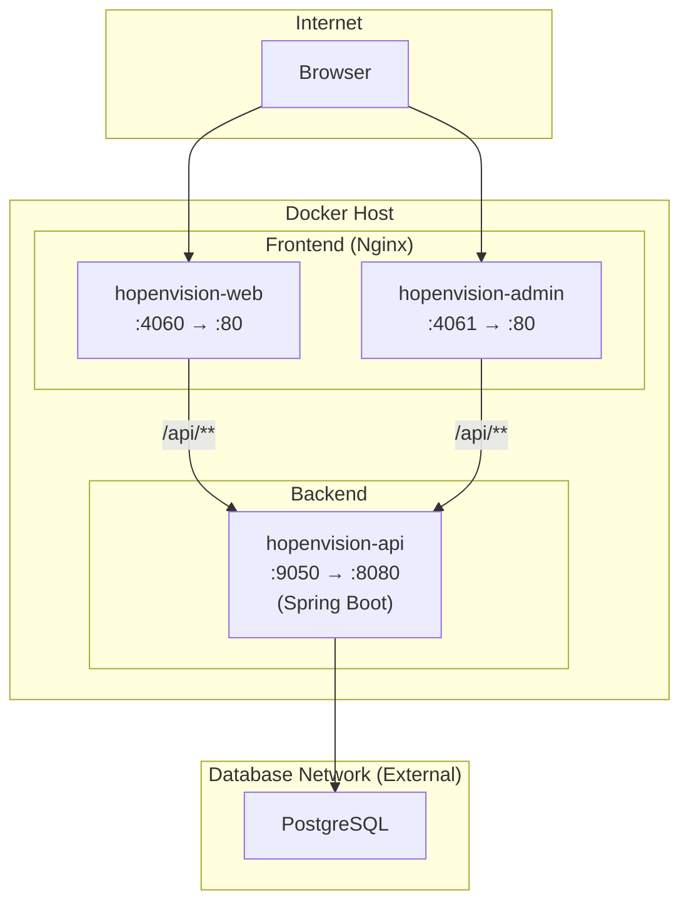
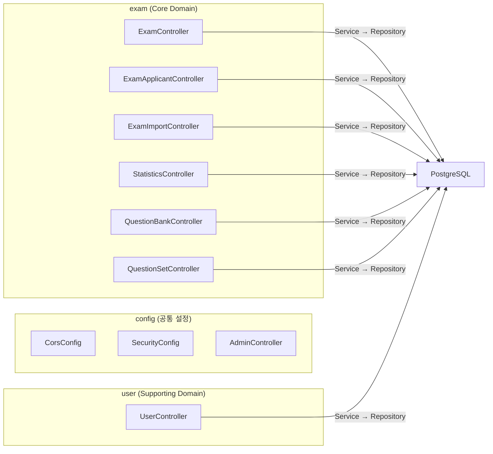
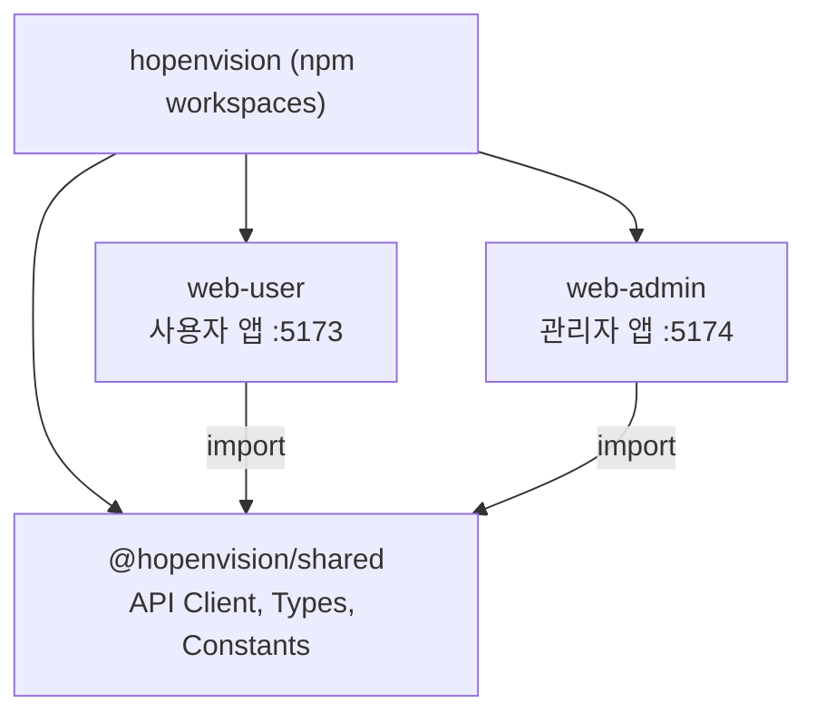
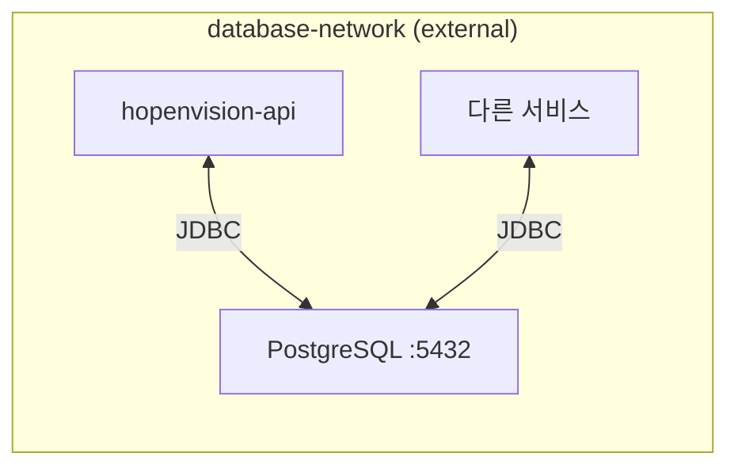

# 2. Architecture

## 2.1 시스템 아키텍처



### 컨테이너 구성

| 컨테이너 | 이미지 | 포트 | 설명 |
|----------|--------|------|------|
| hopenvision-api | hopenvision-api | 9050:8080 | Spring Boot 백엔드 |
| hopenvision-web | hopenvision-web | 4060:80 | 사용자 포털 (Nginx + React SPA) |
| hopenvision-admin | hopenvision-admin | 4061:80 | 관리자 콘솔 (Nginx + React SPA) |

---

## 2.2 백엔드 아키텍처

### DDD 패키지 구조



### 계층 구조

```
Controller (REST API)
    ↓ DTO
Service (Business Logic)
    ↓ Entity ↔ DTO (MapStruct)
Repository (Spring Data JPA)
    ↓
PostgreSQL
```

---

## 2.3 프론트엔드 아키텍처

### 모노레포 구조



!!! info "공유 코드 (`@hopenvision/shared`)"
    - **API Client**: Axios 인스턴스 팩토리 — 환경별 baseURL 자동 설정
    - **공통 타입**: `ApiResponse<T>`, `PageResponse<T>` 래퍼
    - **상수**: 시험 유형, 과목 유형, 문항 유형 매핑

---

## 2.4 기술 스택 상세

=== "Backend"

    | 기술 | 버전 | 선정 이유 |
    |------|------|-----------|
    | Java | 17 | LTS, 안정성, Spring Boot 호환 |
    | Spring Boot | 3.2.2 | 생산성, 자동 설정, 생태계 |
    | Spring Data JPA | — | Repository 패턴, 쿼리 메서드 |
    | PostgreSQL | 16+ | 고급 SQL, 성능, 확장성 |
    | MapStruct | 1.5.5 | 컴파일 타임 매핑, 타입 안전 |
    | Apache POI | 5.2.5 | Excel 파일 읽기/쓰기 |
    | SpringDoc OpenAPI | 2.3.0 | Swagger UI 자동 생성 |

=== "Frontend"

    | 기술 | 버전 | 선정 이유 |
    |------|------|-----------|
    | React | 19 | 최신 UI 프레임워크, 생태계 |
    | TypeScript | 5.9 | 타입 안전성, 개발 생산성 |
    | Vite | 7 | 빠른 빌드, HMR |
    | Ant Design | 6 | 관리자 UI에 적합한 컴포넌트 |
    | TanStack React Query | 5 | 서버 상태 관리, 캐싱 |
    | Recharts | 3 | 통계 차트 (ADR-003 결정) |

=== "Infrastructure"

    | 기술 | 선정 이유 |
    |------|-----------|
    | Docker Compose | 3-서비스 컨테이너 오케스트레이션 |
    | Nginx | 리버스 프록시 + SPA 서빙 + gzip |
    | GitHub Actions | CI/CD 자동 배포 (prod 브랜치) |
    | npm workspaces | 프론트엔드 모노레포 의존성 관리 |

---

## 2.5 보안 아키텍처

### 인증 방식

| 대상 | 방식 | 설명 |
|------|------|------|
| 관리자 | API Key | `X-Api-Key` 헤더, SecurityConfig 필터 |
| 사용자 | Google OAuth + JWT | Google 로그인 → JWT 토큰 발급 |

### 보안 적용 사항

| 항목 | 구현 |
|------|------|
| CORS | 허용 도메인 명시적 설정 (와일드카드 금지) |
| API 인증 | 관리자 API Key + 사용자 JWT |
| 파일 업로드 | 파일명 검증 (Path Traversal 방지) |
| 보안 헤더 | X-Frame-Options, X-Content-Type-Options |
| 업로드 제한 | 최대 20MB |
| 민감 정보 | 환경변수 관리, 소스코드 하드코딩 금지 |

---

## 2.6 네트워크 구성



- PostgreSQL은 `database-network` 외부 네트워크에서 다른 서비스와 공유
- 프론트엔드 → API: Nginx 리버스 프록시를 통해 접근
- 외부 직접 DB 접근 차단

---

## 2.7 ADR (Architecture Decision Records)

| ADR | 제목 | 결정 |
|-----|------|------|
| ADR-001 | 시스템 아키텍처 | 단일 통합 앱 (마이크로서비스 대신) |
| ADR-002 | 배치 시스템 설계 | Spring Batch 기반 통계 집계 |
| ADR-003 | 차트 라이브러리 | Recharts 선정 |

---

## 2.8 확장성 고려사항

!!! note "현재: 모듈러 모놀리스"
    - DDD 기반 도메인 분리 (exam, user)
    - npm workspaces 기반 프론트엔드 분리
    - 도메인 간 결합도 최소화

**향후 가능한 확장:**

- 배치 시스템 분리 (통계 집계, 순위 계산)
- 문제은행 서비스 독립
- 실시간 알림 (WebSocket)
- 캐싱 레이어 (Redis)
