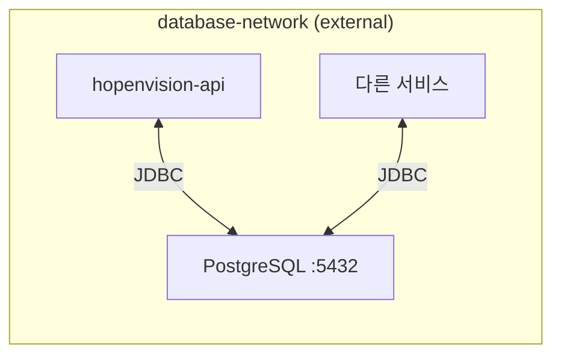
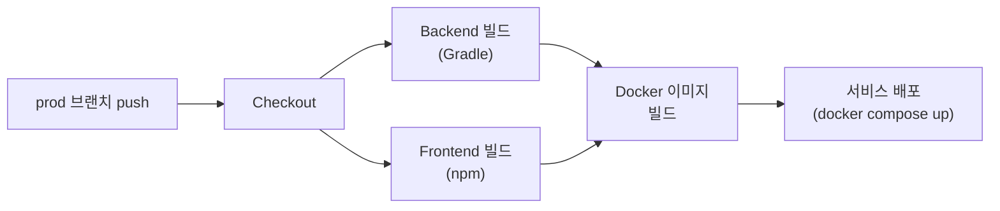
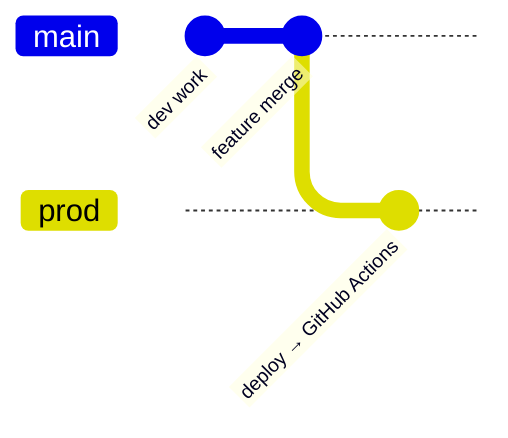

# 6. Deployment

## 6.1 배포 환경

| 항목 | 로컬 개발 | 운영 |
|------|----------|------|
| 프로필 | local / dev | prod |
| DB | H2 / PostgreSQL | PostgreSQL |
| DDL | create | none (수동 마이그레이션) |
| Docker | 선택 | 필수 |
| CI/CD | — | GitHub Actions |

---

## 6.2 Docker Compose 구성

### 서비스

| 서비스 | 이미지 | 포트 | 설명 |
|--------|--------|------|------|
| hopenvision-api | hopenvision-api | 9050:8080 | Spring Boot 백엔드 |
| hopenvision-web | hopenvision-web | 4060:80 | 사용자 포털 (Nginx + React) |
| hopenvision-admin | hopenvision-admin | 4061:80 | 관리자 콘솔 (Nginx + React) |

### 네트워크



- `database-network`: 외부 네트워크 — 다른 서비스와 PostgreSQL 공유
- 프론트엔드 → API: Nginx 리버스 프록시 (`/api/**` → `hopenvision-api:8080`)

### Nginx 설정

| 설정 | 값 |
|------|-----|
| SPA 라우팅 | `try_files $uri $uri/ /index.html` |
| API 프록시 | `/api/` → `http://hopenvision-api:8080` |
| 정적 캐싱 | JS/CSS/이미지: 1년 |
| Gzip | 활성화 |
| 보안 헤더 | X-Frame-Options, X-Content-Type-Options |
| 업로드 | 최대 20MB |

### 헬스체크

```yaml
hopenvision-api:
  healthcheck:
    test: curl -f http://localhost:8080/api/health
    interval: 30s
    timeout: 10s
    retries: 3
```

---

## 6.3 Dockerfile

=== "Backend (api/Dockerfile)"

    ```
    Multi-stage Build:
    1. gradle:jdk17        → Gradle 빌드 (bootJar)
    2. eclipse-temurin:17  → JRE 런타임 (non-root user)
    Port: 8080
    ```

    !!! warning "ARM64 호환성"
        Alpine 이미지는 ARM64 (Apple Silicon) 미지원 — 비-Alpine 이미지 사용

=== "Frontend (web-user, web-admin)"

    ```
    Multi-stage Build:
    1. node:20-alpine  → npm install + Vite 빌드
    2. nginx:1.27      → 정적 파일 서빙
    Port: 80
    ```

---

## 6.4 CI/CD (GitHub Actions)

### 파이프라인



| 항목 | 설정 |
|------|------|
| 트리거 | `prod` 브랜치 push |
| 러너 | Self-hosted (macOS) |
| 빌드 | Gradle (Backend) + npm (Frontend) |
| 배포 | Docker Compose |

---

## 6.5 도메인 매핑

| 서비스 | 도메인 | 포트 |
|--------|--------|------|
| 사용자 포털 | study.unmong.com | 4060 |
| 관리자 콘솔 | admin.unmong.com | 4061 |
| API (내부) | — | 9050 |

---

## 6.6 브랜치 전략



- `main`: 개발 브랜치 (PR 기반 merge)
- `prod`: 운영 브랜치 (push 시 자동 배포)

---

## 6.7 배포 체크리스트

!!! tip "배포 전"
    - [ ] `main` 브랜치에서 빌드 성공 확인
    - [ ] 테스트 통과 (`./gradlew test`)
    - [ ] DB 마이그레이션 스크립트 준비
    - [ ] 환경 변수 확인 (`.env`)
    - [ ] 프론트엔드 빌드 성공 (`npm run build`)

!!! tip "배포 후"
    - [ ] 헬스체크 (`/api/health`)
    - [ ] API 응답 확인 (`/api/exams`)
    - [ ] 프론트엔드 페이지 로딩
    - [ ] 로그 모니터링
    - [ ] DB 마이그레이션 확인

---

## 6.8 트러블슈팅

| 문제 | 원인 | 해결 |
|------|------|------|
| 포트 충돌 | 다른 서비스가 같은 포트 사용 | `docker ps`로 확인 후 포트 변경 |
| Alpine ARM64 실패 | Alpine 이미지 ARM64 미지원 | 비-Alpine 이미지 사용 |
| gradlew 실행 오류 | Windows CRLF | Dockerfile에서 `sed`로 수정 |
| DB 연결 실패 | database-network 미생성 | `docker network create database-network` |
| VITE_API_URL 오류 | 빈 문자열 처리 | `??` (nullish coalescing) 사용 |
