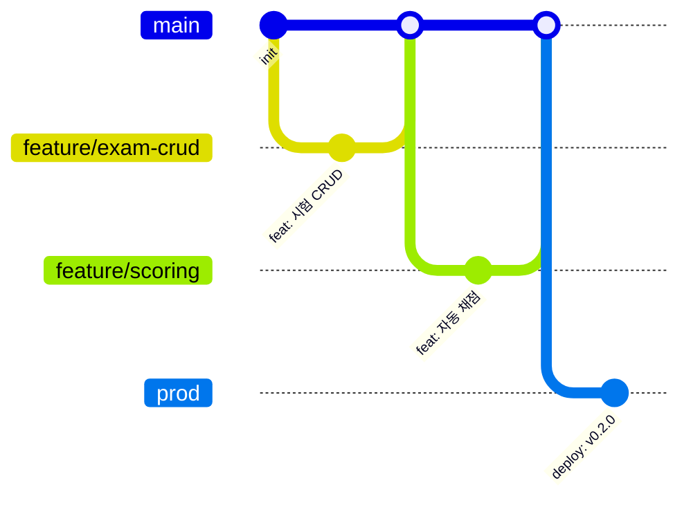

# 5. Development Guide

## 5.1 개발 환경 요구사항

| 도구 | 버전 | 용도 |
|------|------|------|
| Git | 2.x+ | 버전 관리 |
| Java | 17 (LTS) | 백엔드 런타임 |
| Node.js | 20+ | 프론트엔드 빌드 |
| Docker | 24+ | 컨테이너 (선택) |
| PostgreSQL | 16+ | 데이터베이스 |

---

## 5.2 로컬 개발 환경 설정

### 저장소 클론

```bash
git clone https://github.com/bluevlad/hopenvision.git
cd hopenvision
```

### Backend 설정

```bash
cd api

# 빌드
./gradlew build

# 실행 (local 프로필 - H2 인메모리 DB)
./gradlew bootRun

# 실행 (dev 프로필 - PostgreSQL)
SPRING_PROFILES_ACTIVE=dev ./gradlew bootRun

# 테스트
./gradlew test
```

### Frontend 설정

```bash
# 루트 디렉토리에서
npm install

# 사용자 앱 개발 서버
npm run dev:user      # http://localhost:5173

# 관리자 앱 개발 서버
npm run dev:admin     # http://localhost:5174

# 전체 빌드
npm run build

# Lint
npm run lint
```

### Docker 전체 서비스

```bash
docker compose --profile all up -d
```

---

## 5.3 Spring Profiles

| 프로필 | DB | DDL 모드 | 용도 |
|--------|-----|---------|------|
| `local` | H2 인메모리 | create | 로컬 개발 |
| `dev` | PostgreSQL | create | 개발 서버 |
| `prod` | PostgreSQL | none | 운영 서버 |

!!! warning "운영 환경 주의"
    운영은 DDL `none` — 스키마 변경 시 수동 마이그레이션 필수

---

## 5.4 포트 매핑

| 서비스 | 로컬 개발 | Docker |
|--------|----------|--------|
| Backend API | 8080 | 9050:8080 |
| Frontend User | 5173 (Vite dev) | 4060:80 |
| Frontend Admin | 5174 (Vite dev) | 4061:80 |
| H2 Console | 8080/h2-console | — |
| Swagger UI | 8080/swagger-ui.html | 9050/swagger-ui.html |

---

## 5.5 코드 컨벤션

=== "Backend (Java/Spring)"

    | 항목 | 규칙 |
    |------|------|
    | 아키텍처 | DDD — 도메인별 `controller/dto/entity/repository/service` |
    | DTO 매핑 | MapStruct 사용 (수동 매핑 금지) |
    | API 응답 | `ApiResponse<T>` 래퍼 통일 |
    | 네이밍 | camelCase (Java), snake_case (DB 컬럼) |
    | 어노테이션 | Lombok (`@Data`, `@Builder`) |
    | 예외 처리 | `@ControllerAdvice` + 커스텀 예외 |
    | DB 문법 | PostgreSQL 전용 (Oracle/H2 금지) |

=== "Frontend (TypeScript/React)"

    | 항목 | 규칙 |
    |------|------|
    | 언어 | TypeScript strict mode |
    | 상태 관리 | TanStack React Query (서버 상태) |
    | UI | Ant Design 6 컴포넌트 우선 |
    | HTTP | Axios + `@hopenvision/shared` API Client |
    | 타입 | 공통 타입은 `web-shared`에 정의 |
    | 패키지 | `@hopenvision/shared` workspace 의존성 |

---

## 5.6 Git 브랜치 전략



| 브랜치 | 용도 |
|--------|------|
| `main` | 개발 (PR merge 대상) |
| `prod` | 운영 (push 시 자동 배포) |
| `feature/*` | 기능 개발 |
| `bugfix/*` | 버그 수정 |
| `hotfix/*` | 긴급 수정 |

### 커밋 메시지 (Conventional Commits)

```
<type>(<scope>): <subject>
```

| Type | 설명 |
|------|------|
| feat | 새 기능 |
| fix | 버그 수정 |
| docs | 문서 |
| refactor | 리팩토링 |
| test | 테스트 |
| chore | 빌드/설정 변경 |

---

## 5.7 금지 사항

!!! danger "Database"
    - Oracle 문법 사용 금지 (`NVL` → `COALESCE`, `SYSDATE` → `CURRENT_TIMESTAMP`)
    - H2 호환성 가정 금지 — PostgreSQL 전용 기능 사용 가능
    - `ROWNUM` 사용 금지 — `LIMIT/OFFSET` 사용
    - DDL 자동 생성 의존 금지 (운영은 수동 마이그레이션)

!!! danger "Security"
    - 자격증명을 소스코드에 하드코딩 금지
    - CORS에 `allow_origins=["*"]` 사용 금지
    - API 엔드포인트를 인증 없이 노출 금지
    - `console.log`로 민감 정보 출력 금지
    - 파일 업로드 시 파일명 검증 없이 사용 금지 (Path Traversal)

!!! danger "Operations"
    - 운영 Docker 컨테이너 직접 조작 금지
    - 서버 주소/비밀번호/컨테이너명 추측 금지
    - `.env`, credentials 파일 커밋 금지

---

## 5.8 환경 변수

!!! note "보안"
    값은 `.env` 파일에서 관리하며, 소스코드에 포함하지 않습니다.

=== "Backend"

    | 변수명 | 설명 |
    |--------|------|
    | `SPRING_PROFILES_ACTIVE` | 활성 프로필 |
    | `DB_HOST` | PostgreSQL 호스트 |
    | `DB_PORT` | PostgreSQL 포트 |
    | `DB_NAME` | 데이터베이스명 |
    | `DB_USERNAME` | DB 사용자명 |
    | `DB_PASSWORD` | DB 비밀번호 |
    | `JWT_SECRET` | JWT 서명 키 |
    | `ADMIN_API_KEY` | 관리자 API Key |
    | `GOOGLE_CLIENT_ID` | Google OAuth Client ID |
    | `CORS_ALLOWED_ORIGINS` | CORS 허용 도메인 |

=== "Frontend"

    | 변수명 | 설명 |
    |--------|------|
    | `VITE_API_URL` | API 서버 URL (빈 문자열 = 같은 도메인) |
    | `VITE_GOOGLE_CLIENT_ID` | Google OAuth Client ID |
