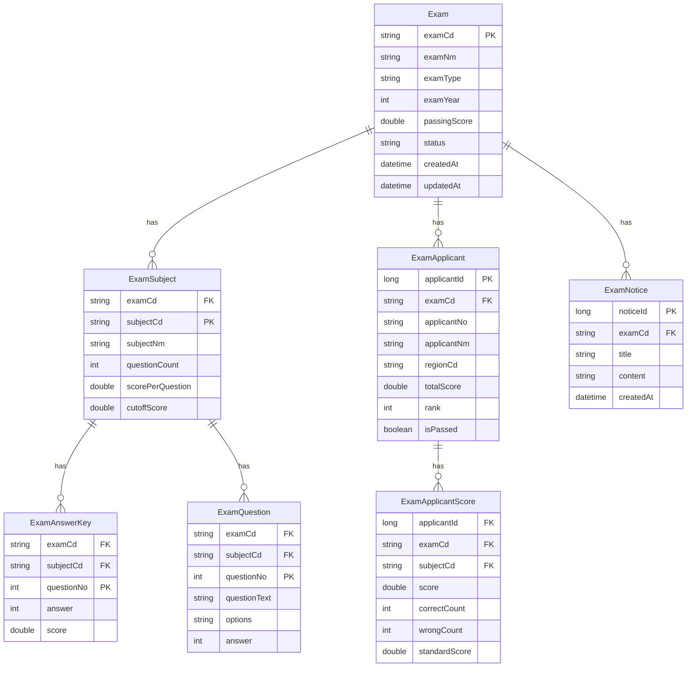
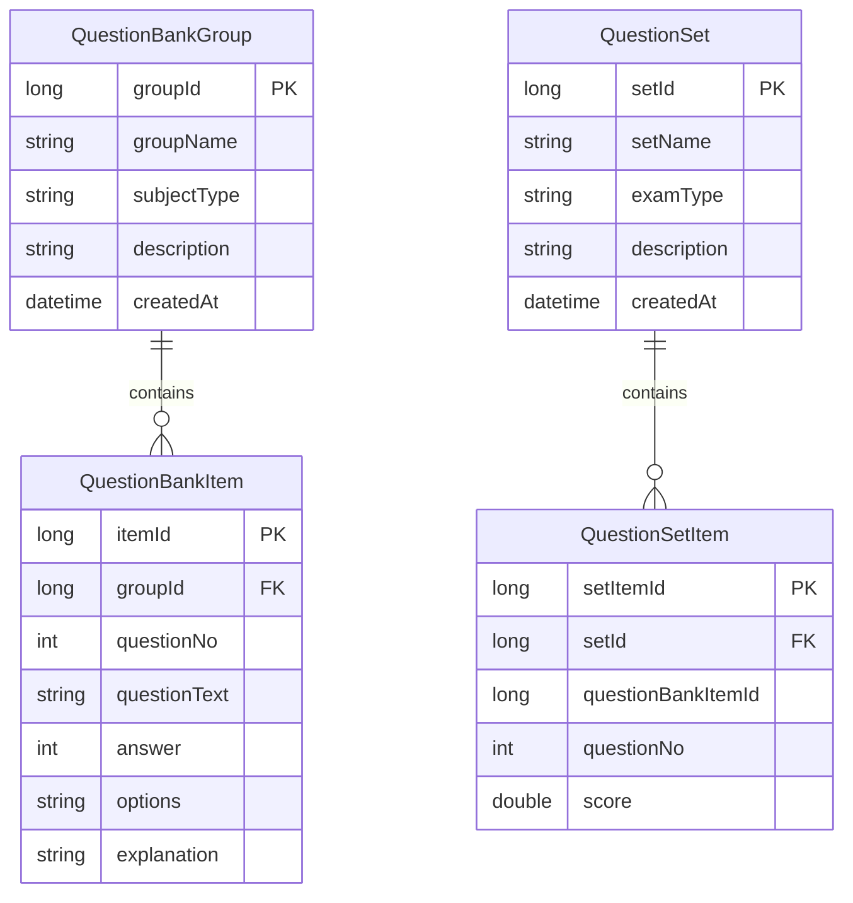
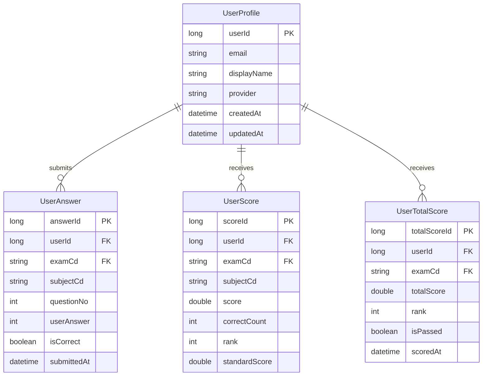

# 3. Domain Model

## 3.1 유비쿼터스 언어

| 한국어 | 영어 | 설명 |
|--------|------|------|
| 시험 | Exam | 시험 마스터 정보 (시험코드, 시험명, 유형, 년도) |
| 과목 | Subject | 시험에 속한 과목 (과목명, 문항수, 배점) |
| 정답 | Answer Key | 과목별 문항의 정답 |
| 문항 | Question | 시험 문항 (문항번호, 정답, 배점) |
| 응시자 | Applicant | 시험 응시자 (수험번호, 이름, 지역) |
| 채점 | Scoring | 응시자 답안 대비 정답 비교 채점 |
| 성적 | Score | 채점 결과 (과목점수, 총점, 순위) |
| 과락 | Cut-off | 과목별 최소 합격 점수 |
| 합격선 | Passing Score | 총점 기준 합격 점수 |
| 표준점수 | Standard Score | T점수/Z점수 기반 표준화 점수 |
| 변별도 | Discrimination | 문항의 상위/하위 수험생 구별 정도 |
| 문제은행 | Question Bank | 문항 풀 관리 (그룹/아이템) |
| 문제세트 | Question Set | 문제은행에서 추출한 시험용 문항 세트 |
| OMR | OMR Card | 답안 마킹 카드 (웹 UI) |

---

## 3.2 도메인 영역

| 구분 | 도메인 | 설명 |
|------|--------|------|
| **Core** | exam (시험/채점) | 시험 관리, 과목, 정답, 응시자, 채점, 통계 |
| **Supporting** | user (사용자) | 사용자 프로필, 답안 제출, 성적 조회 |
| **Generic** | config (설정) | CORS, Security, Admin 인증 |

---

## 3.3 ER 다이어그램

### 시험 도메인 (Core)

### 문제은행/문제세트

### 사용자 도메인 (Supporting)

---

## 3.4 엔티티 명세

### Exam (시험)

| 필드 | 타입 | 설명 |
|------|------|------|
| examCd | String (PK) | 시험 코드 |
| examNm | String | 시험명 |
| examType | String | 시험 유형 (7급, 9급 등) |
| examYear | Integer | 시험 년도 |
| passingScore | Double | 합격 점수 |
| status | String | 상태 (READY, ACTIVE, COMPLETED) |
| createdAt | LocalDateTime | 생성일시 |
| updatedAt | LocalDateTime | 수정일시 |

### ExamSubject (과목)

| 필드 | 타입 | 설명 |
|------|------|------|
| examCd | String (FK) | 시험 코드 |
| subjectCd | String (PK) | 과목 코드 |
| subjectNm | String | 과목명 |
| questionCount | Integer | 문항 수 |
| scorePerQuestion | Double | 문항당 배점 |
| cutoffScore | Double | 과락 점수 |

### ExamApplicant (응시자)

| 필드 | 타입 | 설명 |
|------|------|------|
| applicantId | Long (PK) | 응시자 ID |
| examCd | String (FK) | 시험 코드 |
| applicantNo | String | 수험번호 |
| applicantNm | String | 이름 |
| regionCd | String | 응시 지역 |
| totalScore | Double | 총점 |
| rank | Integer | 순위 |
| isPassed | Boolean | 합격 여부 |

---

## 3.5 비즈니스 규칙

### 채점 규칙

!!! info "자동 채점 로직"
    1. 정답 일치 시 해당 문항의 배점만큼 점수 부여
    2. 과목별 점수 = 정답 문항 수 × 문항당 배점
    3. 총점 = 전 과목 점수 합계
    4. 순위는 총점 기준 내림차순 (동점 시 동일 순위)

### 합격 판정

!!! warning "합격 조건 (AND)"
    1. 총점이 합격선(passingScore) **이상**
    2. 모든 과목이 과락(cutoffScore) **이상**
    3. 두 조건 **모두** 충족 시 합격

### 표준점수 산출

| 점수 | 공식 |
|------|------|
| Z점수 | (원점수 - 평균) / 표준편차 |
| T점수 | 50 + 10 × Z점수 |

### 문항 분석

| 지표 | 공식 | 구간 |
|------|------|------|
| 정답률 | 정답자 수 / 전체 응시자 수 | — |
| 변별도 | 상위 27% 정답률 - 하위 27% 정답률 | — |
| 난이도 | 정답률 기반 | 쉬움(>0.8), 보통(0.4~0.8), 어려움(<0.4) |
