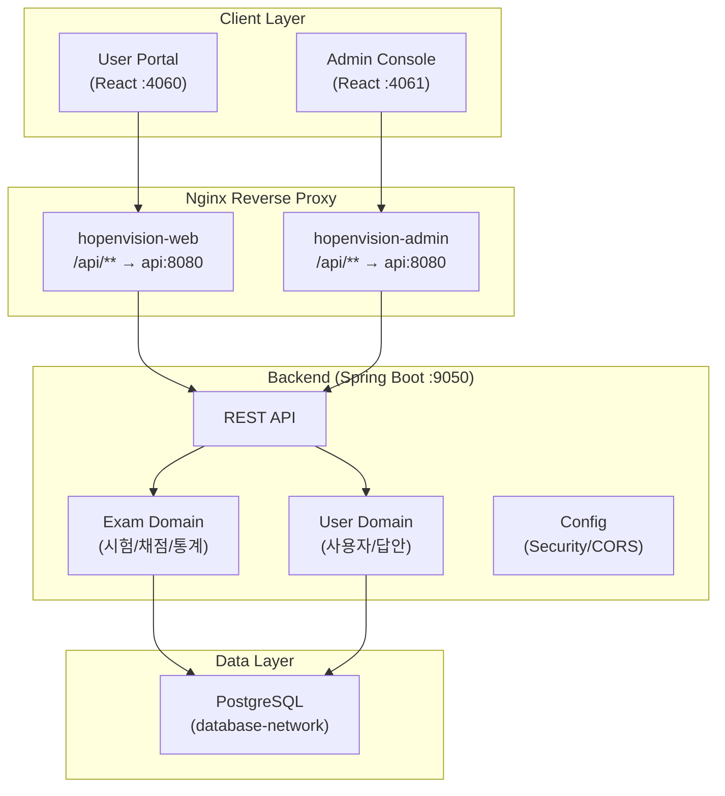

# HopenVision

<div style="text-align: center; margin-bottom: 1em;">
  <span class="md-badge md-badge--primary">v0.2.0</span>
  <span class="md-badge md-badge--success">Active</span>
  <span class="md-badge md-badge--info">Private</span>
</div>

> **공무원 시험 성적 관리 및 채점 시스템**

HopenVision은 공무원 시험의 시험 정보, 과목, 정답, 응시자, 채점 결과를 통합 관리하는 웹 기반 시스템입니다. Excel 업로드를 통한 일괄 데이터 관리, 자동 채점, 표준점수 산출, 통계 대시보드를 제공하며, 수험생이 직접 답안을 입력하고 채점 결과를 확인할 수 있는 사용자 포털을 포함합니다.

---

## 핵심 기능

=== "관리자 콘솔 (Admin)"

    | 기능 | 설명 |
    |------|------|
    | **시험 관리** | 시험 마스터 정보 CRUD, 상태 관리 |
    | **과목 관리** | 시험별 과목 정보 (문항수, 배점, 과락) |
    | **정답 관리** | 문항별 정답 입력, Excel/JSON 일괄 가져오기 |
    | **응시자 관리** | 수험번호, 이름, 답안 입력 및 Excel 업로드 |
    | **자동 채점** | 정답 대비 자동 채점, 재채점 |
    | **통계 분석** | 평균, 합격률, 변별도, 취약점, 대시보드 |
    | **문제은행** | 문제은행 그룹/아이템 관리 |
    | **문제세트** | 문제세트 구성 및 시험 배포 |

=== "사용자 포털 (User)"

    | 기능 | 설명 |
    |------|------|
    | **시험 목록** | 참여 가능한 시험 조회 |
    | **OMR 답안 입력** | OMR 카드 형식 + 빠른 입력 |
    | **자동 채점** | 답안 제출 즉시 채점 |
    | **성적 분석** | 과목별 점수, 순위, 표준점수 |
    | **취약 영역** | 영역별 정답률 분석 |
    | **응시 이력** | 과거 응시 기록, 성적 추이 |

---

## 시스템 구조



---

## 기술 스택

### Backend

| 기술 | 버전 | 용도 |
|------|------|------|
| Java | 17 | 런타임 |
| Spring Boot | 3.2.2 | Web Framework |
| Spring Data JPA | — | ORM |
| PostgreSQL | 16+ | Database |
| MapStruct | 1.5.5 | DTO ↔ Entity 매핑 |
| Apache POI | 5.2.5 | Excel 처리 |
| SpringDoc OpenAPI | 2.3.0 | API 문서 (Swagger) |

### Frontend

| 기술 | 버전 | 용도 |
|------|------|------|
| React | 19 | UI Framework |
| TypeScript | 5.9 | 타입 안정성 |
| Vite | 7 | Build Tool |
| Ant Design | 6 | UI 컴포넌트 |
| TanStack React Query | 5 | 서버 상태 관리 |
| Recharts | 3 | 차트/시각화 |

### Infrastructure

| 기술 | 용도 |
|------|------|
| Docker Compose | 3-서비스 오케스트레이션 |
| Nginx | 리버스 프록시 + SPA 서빙 |
| GitHub Actions | CI/CD (Self-hosted Runner) |
| npm workspaces | 프론트엔드 모노레포 |

---

## 빠른 시작

```bash
# 1. 저장소 클론
git clone https://github.com/bluevlad/hopenvision.git
cd hopenvision

# 2. Backend 실행
cd api && ./gradlew bootRun

# 3. Frontend 실행 (루트에서)
cd .. && npm install
npm run dev:user    # http://localhost:5173
npm run dev:admin   # http://localhost:5174

# 4. Docker 전체 서비스 (선택)
docker compose --profile all up -d
```

---

## 프로젝트 구조

```
hopenvision/
├── api/                        # Spring Boot 백엔드
│   └── src/main/java/com/hopenvision/
│       ├── config/             # 설정 (CORS, Security)
│       ├── exam/               # 시험/채점 도메인 (DDD)
│       └── user/               # 사용자 도메인 (DDD)
├── web-shared/                 # @hopenvision/shared (공유 코드)
├── web-user/                   # 사용자 앱 (채점)
├── web-admin/                  # 관리자 앱 (시험관리)
├── doc/                        # 프로젝트 문서
├── wiki/                       # GitHub Wiki 원본
├── wiki-site/                  # MkDocs 위키 사이트 (이 사이트)
├── docker-compose.yml          # 개발용
└── docker-compose.prod.yml     # 운영용
```
