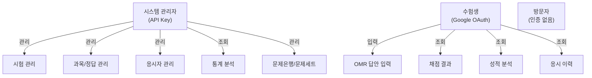

# 1. Project Overview

## 1.1 프로젝트 소개

| 항목 | 내용 |
|------|------|
| **프로젝트명** | HopenVision |
| **버전** | 0.2.0 |
| **상태** | Active Development |
| **라이선스** | Private |
| **설명** | 공무원 시험 성적 관리 및 채점 시스템 |

HopenVision은 공무원 시험의 전체 라이프사이클을 지원하는 웹 기반 통합 시스템입니다.

- **관리자**: 시험 정보 등록, 과목 설정, 정답 입력, 응시자 관리, 자동 채점, 통계 분석
- **수험생**: 온라인 답안 입력, 실시간 채점, 성적 분석, 응시 이력 관리

---

## 1.2 비전 및 목표

### 비전

> 모든 수험생이 자신의 학습 상태를 정확히 파악하고, 효율적으로 시험을 준비할 수 있도록 돕는다.

### 미션

공무원 시험의 채점과 성적 관리를 자동화하여 관리자의 업무 부담을 줄이고, 수험생에게 즉각적인 피드백과 분석 정보를 제공한다.

### 핵심 목표

| 목표 | 설명 |
|------|------|
| **자동 채점** | 정답 대비 자동 채점 → 수작업 채점 오류 제거 |
| **즉각적 피드백** | 답안 제출 즉시 채점 결과 및 분석 제공 |
| **데이터 기반 분석** | 문항 변별도, 취약 영역, 합격 예측 등 통계 분석 |
| **효율적 관리** | Excel 일괄 처리, 재채점, 문제은행 관리 |
| **접근성** | 웹 기반으로 시간/장소 제한 없는 서비스 제공 |

---

## 1.3 핵심 가치 제안

=== "관리자 (Before → After)"

    | Before | After |
    |--------|-------|
    | 수작업 채점 및 성적 입력 | 자동 채점 + 즉시 결과 산출 |
    | Excel 수동 집계 | Excel 업로드 → 자동 처리 |
    | 통계 수작업 계산 | 실시간 통계 대시보드 |
    | 정답 변경 시 전체 재채점 | 원클릭 재채점 |
    | 문항 분석 불가 | 변별도, 난이도, 정답률 자동 분석 |

=== "수험생 (Before → After)"

    | Before | After |
    |--------|-------|
    | 채점 결과 대기 | 제출 즉시 채점 결과 확인 |
    | 종이 OMR 마킹 | 웹 OMR 카드 + 빠른 입력 |
    | 성적 분석 없음 | 과목별/영역별 취약점 분석 |
    | 이력 관리 불가 | 응시 이력 및 성적 추이 확인 |
    | 순위/표준점수 모름 | 순위, 표준점수, 합격 예측 |

---

## 1.4 이해관계자

| 역할 | 설명 | 인증 방식 |
|------|------|-----------|
| **시스템 관리자** | 시험/과목/정답/응시자 전체 관리 | API Key |
| **수험생** | 답안 입력, 채점, 성적 확인 | Google OAuth / JWT |
| **방문자** | 공개 시험 정보 조회 | 없음 |

---

## 1.5 주요 기능 요약

=== "관리자 기능"

    | 카테고리 | 기능 | 설명 | 상태 |
    |----------|------|------|------|
    | 시험 관리 | 시험 CRUD | 시험코드, 시험명, 유형, 합격기준 | :white_check_mark: |
    | 시험 관리 | 시험 상태 변경 | 준비중/진행중/완료 | :white_check_mark: |
    | 과목 관리 | 과목 설정 | 과목명, 문항수, 배점, 과락 | :white_check_mark: |
    | 정답 관리 | 정답 입력 | 문항별 정답 입력/수정 | :white_check_mark: |
    | 정답 관리 | Excel 가져오기 | 미리보기 포함 일괄 업로드 | :white_check_mark: |
    | 정답 관리 | JSON 가져오기 | 문항 데이터 업로드 | :white_check_mark: |
    | 응시자 | 응시자 CRUD | 수험번호, 이름, 답안 관리 | :white_check_mark: |
    | 응시자 | Excel 업로드 | 일괄 등록 | :white_check_mark: |
    | 채점 | 자동 채점 | 과목별/총점 산출 | :white_check_mark: |
    | 채점 | 재채점 | 정답 변경 시 전체 재채점 | :white_check_mark: |
    | 통계 | 기본 통계 | 평균, 합격률, 표준편차 | :white_check_mark: |
    | 통계 | 문항 분석 | 정답률, 변별도, 난이도 | :white_check_mark: |
    | 통계 | 취약점/대시보드 | 영역별 취약점, 종합 대시보드 | :white_check_mark: |
    | 문제 | 문제은행/문제세트 | 그룹/아이템/세트 관리 | :white_check_mark: |

=== "사용자 기능"

    | 카테고리 | 기능 | 설명 | 상태 |
    |----------|------|------|------|
    | 시험 | 시험 목록/상세 | 참여 가능 시험 조회 | :white_check_mark: |
    | 답안 | OMR 카드 입력 | OMR 형식 UI | :white_check_mark: |
    | 답안 | 빠른 입력 | 숫자키 기반 | :white_check_mark: |
    | 채점 | 자동 채점 | 즉시 채점 | :white_check_mark: |
    | 분석 | 성적 분석 | 점수, 순위, 표준점수 | :white_check_mark: |
    | 이력 | 응시 이력 | 기록, 성적 추이 | :white_check_mark: |
    | 프로필 | 프로필 관리 | 사용자 정보 수정 | :white_check_mark: |

---

## 1.6 기술적 특징

| 특징 | 설명 |
|------|------|
| **DDD 아키텍처** | 도메인 주도 설계 (exam, user, admin 도메인 분리) |
| **모노레포** | npm workspaces (web-shared, web-user, web-admin) |
| **MapStruct** | 컴파일 타임 DTO ↔ Entity 매핑 |
| **TanStack Query** | 서버 상태 관리 + 캐싱 + 자동 리페치 |
| **표준점수** | T점수, Z점수 기반 표준점수 산출 |
| **Excel 처리** | Apache POI 기반 대량 데이터 업로드/다운로드 |

---

## 1.7 프로젝트 범위

!!! success "In Scope"
    - 공무원 시험 관리 (7급, 9급 등)
    - 객관식 시험 자동 채점
    - 과목별/문항별 통계 분석
    - 수험생 셀프 채점 (온라인 답안 입력)
    - Excel/JSON 기반 데이터 가져오기
    - 문제은행 및 문제세트 관리
    - 표준점수 및 순위 산출

!!! warning "Out of Scope"
    - 주관식/서술형 채점
    - 실시간 온라인 시험 감독
    - 결제 및 수수료 관리
    - 모바일 앱 (웹 반응형으로 대응)
    - OMR 이미지 인식 (OCR)

---

## 1.8 성공 기준

| 구분 | 지표 | 목표 |
|------|------|------|
| 정량적 | 채점 정확도 | 100% (자동 채점) |
| 정량적 | 채점 소요 시간 | 100명 기준 < 3초 |
| 정량적 | Excel 업로드 성공률 | > 99% |
| 정성적 | 관리자 업무 효율 | 수작업 대비 80% 이상 단축 |
| 정성적 | 수험생 만족도 | 즉각적 피드백 제공 |
