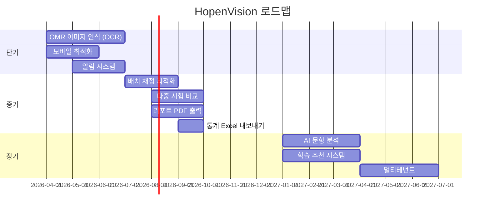

# 7. Roadmap

## 7.1 릴리스 이력

### v0.2.0 (2025-02-06)

!!! note "설계 및 문서화"
    - 구현 방안 제안서 작성
    - Architecture Decision Records (ADR) 체계 구축
        - ADR-001: 시스템 아키텍처 결정 (단일 통합 앱)
        - ADR-002: 배치 시스템 설계
        - ADR-003: 차트 라이브러리 선정 (Recharts)
    - WBS 전면 개편: 6개 Phase로 재구성
    - 변경 관리 체계 (CHANGELOG) 도입

### v0.1.0 (2025-02-06)

!!! note "초기 릴리스"
    - Spring Boot Backend 초기 구성 (시험/과목/정답/Excel)
    - React Frontend 초기 구성 (시험목록/등록/정답/Excel)
    - Docker Compose 설정 (PostgreSQL)
    - GitHub 저장소 연결

---

## 7.2 현재 기능 상태

=== "관리자 콘솔"

    | 기능 | 상태 |
    |------|------|
    | 시험 CRUD | :white_check_mark: 완료 |
    | 시험 상태 변경 | :white_check_mark: 완료 |
    | 과목 관리 | :white_check_mark: 완료 |
    | 정답 입력/수정 | :white_check_mark: 완료 |
    | Excel 정답지 가져오기 | :white_check_mark: 완료 |
    | JSON 문항 가져오기 | :white_check_mark: 완료 |
    | 응시자 CRUD | :white_check_mark: 완료 |
    | 응시자 Excel 업로드 | :white_check_mark: 완료 |
    | 자동 채점 / 재채점 | :white_check_mark: 완료 |
    | 기본 통계 | :white_check_mark: 완료 |
    | 문항 분석 (변별도) | :white_check_mark: 완료 |
    | 취약점 분석 | :white_check_mark: 완료 |
    | 통계 대시보드 | :white_check_mark: 완료 |
    | 문제은행 / 문제세트 | :white_check_mark: 완료 |
    | 공지사항 관리 | :white_check_mark: 완료 |

=== "사용자 포털"

    | 기능 | 상태 |
    |------|------|
    | 시험 목록/상세 | :white_check_mark: 완료 |
    | OMR 카드 답안 입력 | :white_check_mark: 완료 |
    | 빠른 입력 (숫자키) | :white_check_mark: 완료 |
    | 답안 제출 (자동 채점) | :white_check_mark: 완료 |
    | 채점 결과 확인 | :white_check_mark: 완료 |
    | 성적 분석 (표준점수) | :white_check_mark: 완료 |
    | 응시 이력 | :white_check_mark: 완료 |
    | 프로필 관리 | :white_check_mark: 완료 |

=== "인프라"

    | 기능 | 상태 |
    |------|------|
    | Docker Compose (개발/운영) | :white_check_mark: 완료 |
    | GitHub Actions CI/CD | :white_check_mark: 완료 |
    | 도메인 설정 | :white_check_mark: 완료 |
    | Swagger API 문서 | :white_check_mark: 완료 |
    | GitHub Wiki / MkDocs 위키 | :white_check_mark: 완료 |

---

## 7.3 향후 계획

### 단기 (Next Quarter)

| 항목 | 설명 | 우선순위 |
|------|------|----------|
| OMR 이미지 인식 | 스캔 OMR 카드 자동 인식 (OCR) | 높음 |
| 모바일 최적화 | 반응형 UI 개선 | 높음 |
| 알림 시스템 | 시험 일정, 채점 완료 알림 | 중간 |

### 중기 (6개월)

| 항목 | 설명 | 우선순위 |
|------|------|----------|
| 배치 채점 | 대량 응시자 일괄 채점 최적화 | 높음 |
| 다중 시험 비교 | 여러 시험 성적 비교 분석 | 중간 |
| 리포트 출력 | 성적표 PDF 다운로드 | 중간 |
| 데이터 내보내기 | 통계 결과 Excel 다운로드 | 중간 |

### 장기 (1년)

| 항목 | 설명 | 우선순위 |
|------|------|----------|
| AI 문항 분석 | AI 기반 문항 품질 분석 | 낮음 |
| 학습 추천 | 취약 영역 기반 학습 추천 | 낮음 |
| 멀티테넌트 | 기관별 독립 운영 | 낮음 |

---

## 7.4 버전 규칙

| 구분 | 설명 |
|------|------|
| MAJOR | 호환되지 않는 API 변경 |
| MINOR | 하위 호환성 있는 기능 추가 |
| PATCH | 하위 호환성 있는 버그 수정 |
