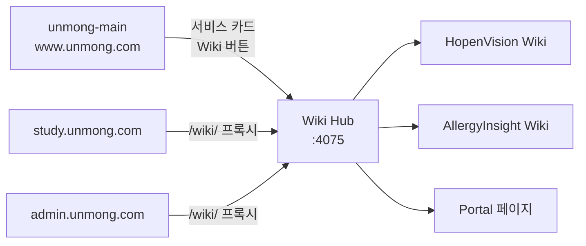

# Wiki 연결 가이드

> Main Gate(unmong-main)에서 Wiki Hub로 연결하는 방법

---

## 개요

HopenVision Wiki는 **Wiki Hub** 독립 서비스(포트 4075)를 통해 서빙됩니다. 각 도메인의 `/wiki/` 경로로 접근할 수 있으며, Main Gate(unmong-main) 포털에서 바로 연결됩니다.

### URL 체계

| 접근 경로 | 대상 |
|-----------|------|
| `https://study.unmong.com/wiki/` | Wiki Hub 포털 (서비스 목록) |
| `https://study.unmong.com/wiki/HopenVision/` | HopenVision Wiki 홈 |
| `https://study.unmong.com/wiki/HopenVision/{page}/` | 하위 페이지 |
| `https://insight.unmong.com/wiki/` | 동일 Wiki Hub (다른 도메인) |

---

## 연결 구조



---

## Main Gate 연결 방법

### 1. 포털 메인 페이지 (index.html)

서비스 카드에 Wiki 버튼을 추가합니다. 현재 AllergyInsight, HopenVision에 적용되어 있습니다.

```html
<!-- unmong-main/src/main/resources/static/index.html -->
<!-- 서비스 카드 헤더 내부에 추가 -->
<span class="service-card__wiki"
      onclick="event.preventDefault();event.stopPropagation();openServicePopup('https://study.unmong.com/wiki/','hopenvision_wiki')"
      title="HopenVision Wiki">
    <span class="service-card__wiki-icon">&#x1F4D6;</span>
    <span class="service-card__wiki-label">Wiki</span>
</span>
```

!!! info "동작 방식"
    `openServicePopup()` 함수로 별도 팝업 윈도우에서 Wiki를 엽니다.
    화면 크기의 85% 비율로 중앙에 열립니다.

### 2. 서비스 랜딩 페이지 (hopenvision.html)

서비스 상세 페이지의 Hero 액션 버튼에 Wiki 링크를 추가합니다.

```html
<!-- unmong-main/src/main/resources/static/services/hopenvision.html -->
<!-- sl-hero-actions 섹션에 추가 -->
<div class="sl-hero-actions">
    <a href="https://study.unmong.com" target="_blank" rel="noopener" class="sl-btn sl-btn-primary">모의고사</a>
    <a href="https://admin.unmong.com" target="_blank" rel="noopener" class="sl-btn sl-btn-outline">관리자</a>
    <a href="https://admin.unmong.com/statistics" target="_blank" rel="noopener" class="sl-btn sl-btn-outline">통계</a>
    <a href="https://study.unmong.com/wiki/HopenVision/" target="_blank" rel="noopener" class="sl-btn sl-btn-outline">Wiki</a>
</div>
```

### 3. Features 섹션에 Wiki 카드 추가

```html
<!-- sl-features 섹션에 추가 -->
<a class="sl-feature" href="https://study.unmong.com/wiki/HopenVision/" target="_blank" rel="noopener">
    <span class="sl-feature-icon">&#128214;</span>
    <div class="sl-feature-name">기술 문서</div>
    <div class="sl-feature-desc">아키텍처, API 명세, 개발 가이드</div>
    <span class="sl-feature-tag">Wiki</span>
</a>
```

---

## 게이트웨이 라우팅 설정

각 도메인의 Nginx 서버 블록에서 `/wiki/` 경로를 Wiki Hub로 프록시합니다.

```nginx
# unmong-gateway 또는 각 서비스 Nginx 설정
# === Wiki Hub ===
location /wiki/ {
    proxy_pass http://host.docker.internal:4075/wiki/;
    proxy_set_header Host $host;
    proxy_set_header X-Real-IP $remote_addr;
    proxy_set_header X-Forwarded-For $proxy_add_x_forwarded_for;
    proxy_set_header X-Forwarded-Proto $scheme;
}
```

| 항목 | 값 |
|------|-----|
| Wiki Hub 포트 | 4075 |
| 컨테이너명 | wiki-hub |
| 네트워크 | gateway-network |
| 헬스체크 | `curl -f http://localhost:4075/wiki/` |

---

## Wiki Hub 내부 라우팅

Wiki Hub의 nginx.conf에서 서비스별 location이 정의되어 있습니다.

```nginx
server {
    listen 4075;
    root /usr/share/nginx/html;

    # 포털 (서비스 목록)
    location = /wiki/ {
        try_files /wiki/index.html =404;
    }

    # HopenVision Wiki
    location /wiki/HopenVision/ {
        try_files $uri $uri/ /wiki/HopenVision/index.html;
    }

    # AllergyInsight Wiki
    location /wiki/AllergyInsight/ {
        try_files $uri $uri/ /wiki/AllergyInsight/index.html;
    }

    # /wiki → /wiki/ 리다이렉트
    location = /wiki {
        return 301 /wiki/;
    }
}
```

---

## 신규 서비스 Wiki 추가 시

Wiki Hub에 새 서비스를 추가하려면 [WIKI_HUB_GUIDE.md](https://github.com/bluevlad/Claude-Opus-bluevlad/blob/main/standards/documentation/WIKI_HUB_GUIDE.md)의 체크리스트를 따릅니다.

### 요약 (5단계)

1. **콘텐츠 준비**: `wiki-hub/{ServiceName}/mkdocs.yml` + `docs/` 작성
2. **빌드 설정**: Dockerfile에 COPY + RUN 추가
3. **포털 등록**: `portal/index.html`에 서비스 카드 추가
4. **검증**: Docker 빌드 + URL 접속 테스트
5. **Main Gate 연결**: unmong-main 포털 및 서비스 랜딩에 Wiki 버튼 추가

---

## 검증 체크리스트

- [ ] Wiki Hub 포털 접속: `curl -f http://localhost:4075/wiki/`
- [ ] HopenVision Wiki 접속: `curl -f http://localhost:4075/wiki/HopenVision/`
- [ ] 하위 페이지 접속: `curl -f http://localhost:4075/wiki/HopenVision/architecture/`
- [ ] 도메인 경유 접속: `https://study.unmong.com/wiki/HopenVision/`
- [ ] Main Gate 포털에서 Wiki 버튼 동작 확인
- [ ] 서비스 랜딩에서 Wiki 링크 동작 확인
